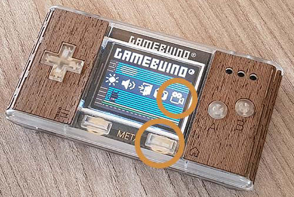

# Pourquoi un nouvel enregistreur vidéo ?

Vous développez un nouveau jeu ? Vous êtes fier de votre nouvelle création et vous voulez sans plus tarder en faire la démonstration sur [Discord](https://discordapp.com/) ou sur le site [gamebuino.com](https://gamebuino.com/creations/) ? Vous aurez probalement envie de faire une GIF animée pour exhiber votre chef-d'œuvre à toute la communauté <i class="far fa-smile"></i>

La Gamebuino META dispose de deux outils intégrés qui vous permettent de faire des captures d'écran et des enregistrements vidéos. Ces outils sont directement accessibles via le bouton **Home** <i class="fa fa-home"></i>. Ce qui nous intéresse ici, c'est la **capture vidéo** :

{: width="250" height="168" class="shadow"}

L'outil fourni avec la META est très utile, certes... néanmoins il s'avère malgré tout assez **limité** et surtout **extrêmement contraignant** !

- Limité car il **ne permet pas** d'enregistrer une capture vidéo d'une application développée pour la **haute résolution** (`160x128` pixels). Seule la résolution standard (`80x64` pixels) est prise en charge. Vous ne pouvez pas non plus déclencher ou arrêter l'enregistrement directement dans votre code, à un moment précis, où lorsque certains événements se produisent : vous devez nécessairement interrompre le déroulement de votre application et passer par le menu accessible avec le bouton Home.

- Contraignant car l'outil de capture enregistre un fichier au format **GMV**... qui est très léger, mais impropre à la lecture dans un navigateur Web. Vous ne pourrez donc rien en faire en l'état. [Soru](https://gamebuino.com/@sorunome) a développé [un petit utilitaire](https://gamebuino.com/creations/gmv-to-gif-converter) qui vous permet de convertir ce fichier GMV en une GIF animée. Mais vous devrez préalablement récupérer le fichier GMV sur la carte microSD avant de pouvoir le convertir... Pour ceux qui se sont déjà prêtés à l'exercice, vous admettrez que ces manipulations peuvent vous rendre fou quand vous vous y reprenez 10 fois pour obtenir un enregistrement qui vous convient !

Ceci m'a naturellement amené à développer un petit utilitaire qui réponde à mes besoins :

- Plus **simple** et plus **rapide** à utiliser.
- Plus **souple** dans la mesure où je peux désormais déclencher ou arrêter l'enregistrement de multiples façons : soit en appuyant sur un bouton, soit directement dans mon code à un moment précis, ou lorsque certains événements se produisent. Par ailleurs, lorsque l'enregistrement a été effectué, je peux encore retravailler les captures d'écran, ou même supprimer les écrans superflus, avant de générer ma GIF animée.
- Plus **évolué** puisque je peux désormais accéder à la haute résolution.

# Quels sont les prérequis de mise en œuvre ?

|                   |           Débutant           |           Intermédiaire            | Avancé | Expert |
|------------------:|:----------------------------:|:----------------------------------:|:------:|:------:|
| **Niveau requis** | <i class="fas fa-check"></i> | <i class="fas fa-check faded"></i> |        |        |

Pour pouvoir installer et utiliser cet outil dans les meilleures conditions, vous devez :

- connaître les rudiments de l'interpréteur de commandes de votre OS,
- maîtriser les notions de base du langage C++,
- avoir suivi avec succès l'atelier [Hello World!](https://gamebuino.com/academy/workshop/make-your-very-first-games-with-pong/hello-world) de l'Académie,
- pour la haute résolution : lire l'article [High Resolution without gb.display](https://gamebuino.com/creations/high-resolution-without-gb-display).

Posséder une Gamebuino META est bien évidemment indispensable pour pouvoir effectuer un enregistrement.

Enfin, pour pouvoir exécuter cet utilitaire et générer des GIF animées, vous devrez disposer des logiciels libres suivants sur votre ordinateur :

- **PHP 7.x** en version **CLI** (*Command Line Interface*), c'est-à-dire accessible depuis votre interpréteur de commandes,
- **ImageMagick**, qui comprend une bibliothèque et un ensemble d'utilitaires en ligne de commande permettant de créer, de convertir, de modifier et d'afficher des images dans un très grand nombre de formats.
